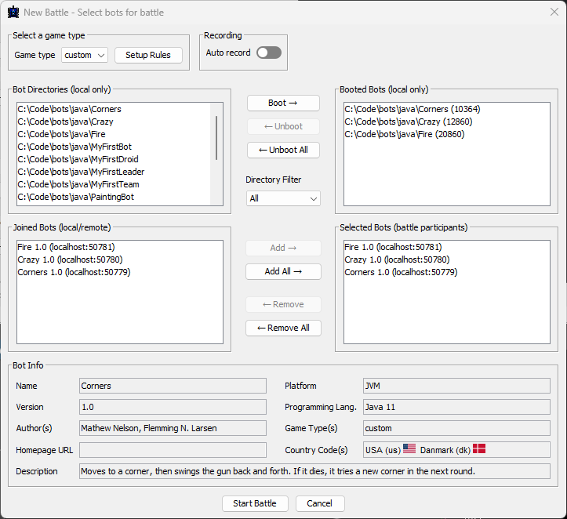
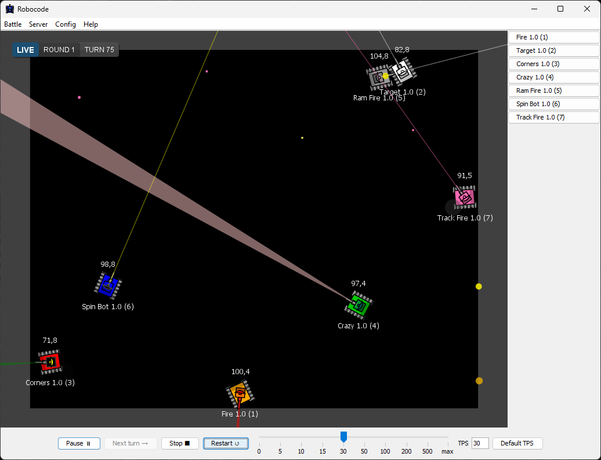
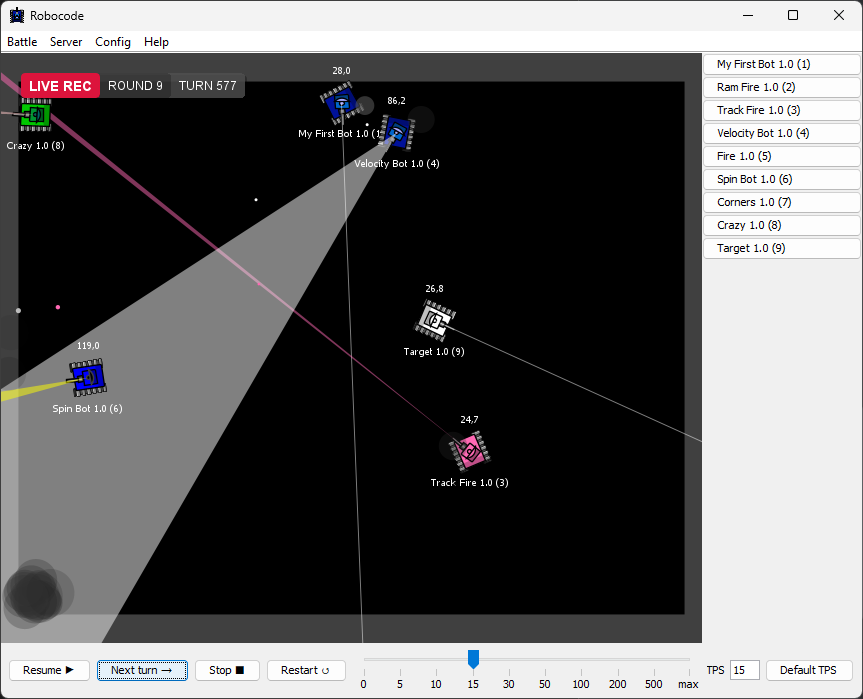
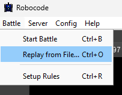
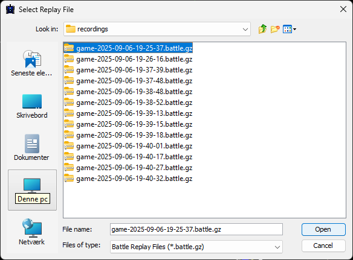
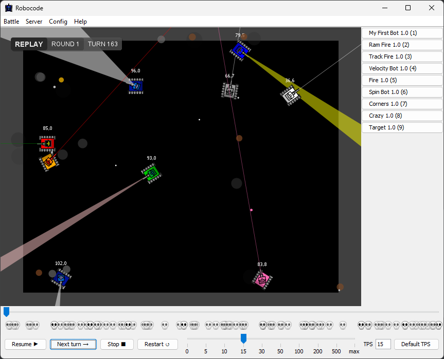
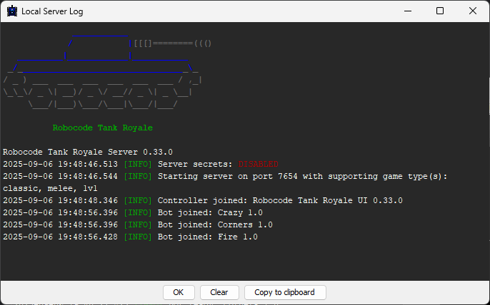
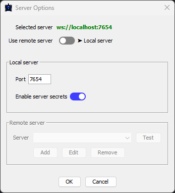
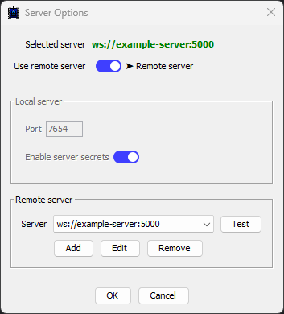
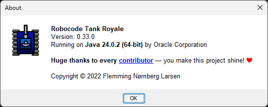

# The GUI

## Introduction

The **GUI** is a graphical user interface for Robocode Tank Royale that provides essential functionality for:

- Managing server connections, including starting a local server or connecting to a remote one
- Creating and configuring battles by selecting bots and defining game rules
- Running bots locally or integrating with remote bots
- Real-time battle visualization with speed control and monitoring capabilities
- Recording and replaying battles for detailed analysis

## Start window

When launching the GUI, you'll be greeted by the start window:


The menu bar at the top provides convenient access to core features with keyboard shortcuts, such as `Ctrl+B` to start a
new battle.

## Starting a battle

The primary function of the GUI is battle creation and bot selection:



The window is organized into four key lists:

- Bot Directories (local) - Available bot types from configured directories
- Booted Bots (local) - Currently bot instances running locally
- Joined Bots (local/remote) - Bots connected to the server locally or remotely
- Selected Bots (battle participants) - Bots chosen for the next battle

At the top, you'll find the 'Select game type' dropdown to choose the [game type], along with a 'Setup Rules' button for
customizing game parameters.


Next to the game type selection is the 'Recording' toggle for battle recording:


When enabled, battles are automatically recorded and saved to individual files in the `recordings` directory.

The bottom panel displays detailed bot information when selecting entries from the 'Bot Directories' list:


### Bot Directories

The **Bot Directories** section lists all detected bot types from your configured local directories, showing absolute
file paths to each bot.


If no directories are configured, you'll see a prompt to set up at least one bot directory root:


To get started, download and extract the sample bot packages, then add their directory through Config → Bot Root
Directories:


### Booted Bots

The **Booted Bots** section shows bots launched through the GUI's built-in [booter]:


Multiple instances of the same bot type can be booted, enabling scenarios like multiple Corners bots battling each
other.

Each entry displays the bot's file path and process ID (pid). The 'Boot' button launches individual bot processes,
while 'Unboot' terminates the selected bot's process.

### Joined Bots

The **Joined Bots** section displays all bots connected to the server, whether local or remote, including those started
via command line or IDE:


Each entry shows the bot's IP address and port, helping distinguish between multiple instances. File paths aren't shown
since the server only tracks WebSocket connections and bot handshake information.

While the booter knows local bot file paths, bots can join through various means without using the booter, such as
custom applications connecting via WebSocket.

### Selected Bots

The **Selected Bots** section lists your chosen bots for the upcoming battle:


The 'Start Battle' button activates once you meet the minimum participant requirements defined in the game
rules ([game type]).

## Viewing the battle

When a battle begins, the view switches to the battle arena:



Use the control panel at the bottom to manage the battle:


Controls include:

- Pause/Resume battle
- Single-step through turns while paused
- Stop/Restart battle
- Adjust TPS (Turns per second) via slider, input field, or default button

### Viewing the bot console

The left side panel contains buttons for each participating bot:


Clicking a bot button opens its console window:


The **Console** tab shows stdout and stderr output from the bot. The [Booter] redirects these streams when launching
bots.

Output includes:

- <font color=gray>Gray</font> labels with turn numbers
- <font color=white>White</font> standard output messages
- <font color=#FF5733>Red</font> standard error messages
- <font color=#377B37>Green</font> game info messages

### Viewing the bot properties

The **Properties** tab displays real-time bot state information for debugging:


### Viewing the bot events

The **Events** tab shows all bot events for debugging purposes:


Events display their turn number, though bots may experience delays due to system load or network latency.

## Recording

The GUI features built-in battle recording capabilities:

Enable auto-recording via the toggle in the New Battle dialog to automatically record each battle:



Recordings save to separate files in the `recordings` directory, enabling detailed replay analysis of bot behavior.

## Replaying

Access recorded battles through Battle → Replay from File...:



Select a recording file:



Click Open to start playback:



The timeline shows battle progress and bot deaths (marked by skulls). Click anywhere on the timeline to jump to that
turn.

Replay controls match live battle controls for pause/resume, stepping, and stopping.

## Setup Rules

Customize rules for each [game type]:


Available game types include: `classic`, `melee`, `1v1`, and `custom` for experimentation.

Rule settings:

| Rule                        | Description                                                                                                                                                                              |
|:----------------------------|:-----------------------------------------------------------------------------------------------------------------------------------------------------------------------------------------|
| Min. Number of Participants | The minimum number of participants required to play the battle.                                                                                                                          |
| Max. Number of Participants | The maximum number of participants allowed to play the battle.                                                                                                                           |
| Number of rounds            | The number of rounds before the game is ended, and game results will show up.                                                                                                            |
| Gun cooling rate            | The decrease of heat per round. The bigger, the faster the gun will cool down.                                                                                                           |
| Max. Inactivity Turns       | The number of turns allowed where no bots have been hit before the game will punish the remaining bots in the arena by decreasing their energy each turn.                                | 
| Ready timeout               | The maximum number of microseconds a bot is allowed before the server must have received a 'Bot Ready' message from the bot. Otherwise, the bot is automatically kicked from the battle. |
| Turn timeout                | The maximum number of microseconds a bot is allowed before the server must have received a 'Bot Intent' message from the bot. Otherwise, the bot will skip the turn. [^skip-turn]        |

## Local Server Log

The GUI provides a built-in server log viewer when running a local server. This allows you to monitor server activity,
debug connection issues, and track battle events in real-time. Note that log viewing is only available for local
servers, not remote servers.



## Server Options

The Server Options dialog allows you to configure and select the server used for battles. At the top of the dialog, you
can see the URL of the currently selected server.

### Local Server

By default, Robocode Tank Royale uses a local server that automatically starts on localhost. You can configure:

- Port number for the server
- Server authentication using secrets
- Security settings to prevent unauthorized access

When server secrets are enabled, all clients and bots must authenticate using the correct secret to join. Bots can
provide the secret either through:

- The Bot API
- Environment variable `ROBOCODE_SERVER_SECRET`



#### Local Server Secrets

The server secrets are located in the `server.properties` file, which is automatically created when starting the
server or GUI for the first time. This file contains the authentication secrets required for bots and controllers to
access the server.

This is an example of a `server.properties` file containing the server secrets:

```properties
bots-secrets=/zWlsdEfhNX1YPggA9DJlw
controller-secrets=Xcrw0ydtiscD7L7xAT/K4g
...
```

You can change the server secrets by editing the `server.properties` file.

The `bots-secrets` contains the secret for authenticating bots, while the `controller-secrets` contains the secret for
authenticating GUI components and the battle recorder.

### Remote Server

It is also possible to use a remote server. This server is expected to run externally, and hence will not be started
automatically when starting a battle. To connect to a remote server:

1. Enter the server URL in WebSocket format (e.g. ws://hostname:port)
2. Specify both the controller and bot secrets that are configured on the remote server
3. Click Apply to save the settings

Without the correct secrets configured, neither the GUI nor bots will be able to authenticate and connect to the remote
server.



## Debug Options

The **Debug Options** dialog provides development and testing features. Currently it includes:

- **Initial Bot Position**: When enabled, allows bots to specify their starting position via either:
    - The `initialPosition` field in their JSON config file
    - Programmatically through the `BotInfo` class

This option is intended for debugging purposes only, as bots are normally not permitted to choose their starting
position.

## Sound Options

The **Sound Options** dialog gives you complete control over the game audio:

- Master sound toggle to enable/disable all audio
- Individual toggles for each sound effect type
- Volume controls for fine-tuning the audio experience


## About box

The about-box provides important system information:

- Robocode Tank Royale version number
- Java runtime version and vendor details
- Links to report [new issue]s on GitHub
- Recognition of project [contributors]

This information is particularly helpful when reporting bugs or compatibility issues.




[^skip-turn]: ? "When a bot is skipping a turn, it is unable to change its speed or turning rates, and will continue
using the speed and turn rates from the last commands successfully sent to the server."

[game type]: game_types.md

[booter]: booter.md

[new issue]: https://github.com/robocode-dev/tank-royale/issues/new/choose "Create new issue"

[contributors]: https://github.com/robocode-dev/tank-royale/graphs/contributors "Contributors"